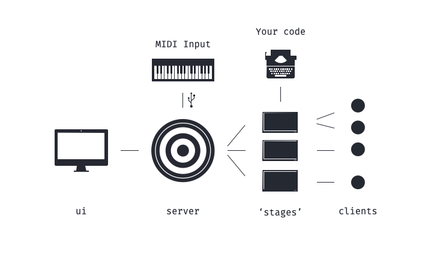

# solv.us

## What is solv.us?
Solv.us is a collection of open-source, web-based & code-oriented software tools for VJing & controlling interactive installations. It enabled you to use the power of the web and existing frameworks for it like Three.js in the context of live events, both in the physical word and online.

### Server

### User Interface
The solv.us UI is the interface where you set up and control your project. It contains a workspace that is customizable with the elements that you need for your performance. 

### Stages

### Clients
Clients are instantiations of the stages. Think of it as the spectators.

## Getting started
- **Set up a [solv.us server](https://github.com/solv-us/server):** To do this, follow the instructions in the [server repository](https://github.com/solv-us/server).
- **Open the user interface:** You can use the online version at [ui.sol.vus](ui.sol.vus), or download it from the [UI repository](https://github.com/solv-us/ui) and run it locally if you don't want to rely on an internet connection.
- Check out the examples, add Midi Devices, and start coding ✨

## Why?
Working as a creative webdeveloper, I made the following observations:

- **Existing creative software for creating live event content is expensive and often not web-friendly.**
The popular VJ software Resolume and creative software environments MAX, TouchDesigner and Isadora, among others, are closed source, expensive, and not oriented to web technologies.
- **The web as a platform is more powerful than ever before and has a rich range of tools for content creation.**
An increasing number of web APIs are increasingly making websites function as full-fledged programs, without users having to go through an installation process like native applications. In addition, frameworks such as Three.js make it accessible to create complex 3D visualisations in the browser.
- **There is no easy way to use those tools for live events.** Setting up a server and integrating hardware is a lot of work that detracts from the creative process, while the requirements are similair for many projects.
- **We will increasingly experience live events via the web.**
More and more large-scale online events are taking place, such as Travis Scottt's online Fortnite concert. But combinations of digital and physical are also becoming more common, such as K / DA's Augmented Reality performance.

solv.us is designed as a general framework for these requirements, so you can focus on the fun parts of creative coding and use it in a live environment.

## Design Choices

### 

### UI
The colors are chosen to be legible in the dark.
The font is (https://github.com/tonsky/FiraCode)[FiraCode]

